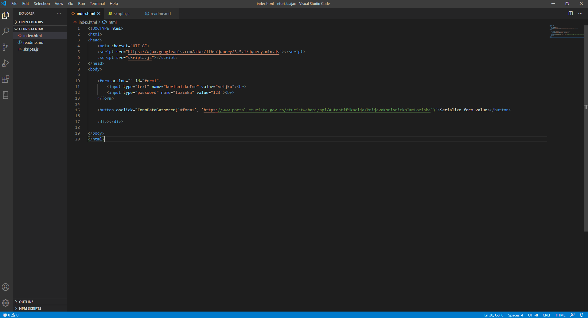

### Functions for gathering data from forms, formatting and dispatching to eturista api.

#### FormDataGatherer method:

 - This method is used to gather data from forms and format it to suitable format.
 Method is called on onclick even in button element. First argument is identificator for form,
 i.e. `#myId`, `.myClass`. It must be unique. Second is url where data needs to be sent to.

 - Method uses jquery serialization so inclusion of jquery is neccessery.
  
 - There are three method which are used to check who decide which api call should be called. Their arguments are array of key names and second one is url to compare. For all them, return value is boolean, true if checks passes, false if not.

 - Then previously named checks are being evaluated. If true, variable for url, method for api call, header and data body are being assembled.

#### IfGetToken method:

 - Accepts two arguments. First one should be array of key names of json array, second is url.
 - It also got preprocessed url string and array with possible data body key name props which are used to compare with it's arguments compatriots.
 - Return value is bollean and depends on comparing previosly mentioned.

#### IfUserCheckedIn method:

 - Same as previous one, but with lot more key names to compare.

#### IfUserCheckedOut method:

 - Same here.

#### postData method:

If check passes, after formatting data and the rest, a async function(this) is being called. It accepts url, method, header and data, which are appropriatelly utilized in it. Only thing that i didn't is what to do with server response. That's left up to users to fill up.

##### Notice for IfUserCheckedInVar check:

This one id different and lot more complicated and less straightforward then ther checks.
It body data object has three sub-object which are assembled from parts of `arr` array since any particular `key -> value` in `arr` are all in separated objects which are counted as members of this array. 
20, 10 and 10 `arr` members are sliced and put in appropriate sub-objects. 
In other check this isn's neccessery since other body datas doesn't have sub-objects, they are one-level.

### How to use:

    Put `FormDataGatherer` method in buttons with parameters. First parameter should be form identificator, second must be url.

    See image:

    

